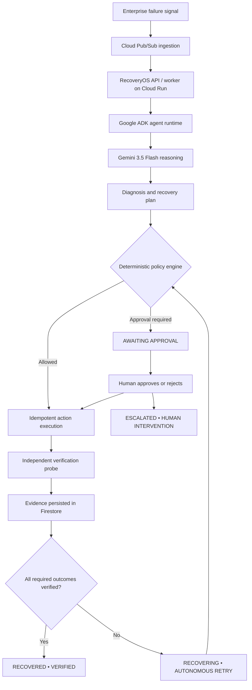

# RecoveryOS

**Governed autonomous recovery for enterprise agent fleets.**

> **Action Executed ≠ Recovery Verified**
> **Autonomy is governed, not assumed.**

RecoveryOS is the reliability and control layer for autonomous enterprise workflows. It detects a failure, lets an agent diagnose and propose a path, applies deterministic policy before any mutation, executes with idempotency and concurrency protection, then independently verifies the required business outcome. A tool response alone can never declare a workflow recovered.

## 30-Second Explanation

Enterprise agents can return `HTTP 200` while the business outcome remains broken. RecoveryOS closes that gap:

`DETECT → DIAGNOSE → PLAN → POLICY → EXECUTE → INDEPENDENTLY VERIFY → RECOVER OR ESCALATE`

Gemini supplies bounded reasoning inside a Google ADK agent runtime. RecoveryOS-native deterministic code remains the authority for policy, state transitions, idempotent execution, verification, and escalation.

## Quickstart

1. Open the [canonical command center](https://recoveryos-321161003794.asia-east1.run.app/).
2. Choose **Simulate an incident** → **Billing provider outage**.
3. Follow the lifecycle: `CREATED • READY` → `EXECUTING • AGENT ACTIVE` → `VERIFYING • OUTCOME CHECK` → `RECOVERED • VERIFIED`.
4. Inspect the Evidence-Backed Recovery Proof. It shows the workflow ID, action and action result separately, verification evidence IDs, required-outcome count, UTC completion time, and final lifecycle.
5. Run **Contradictory evidence** to see policy stop autonomous execution at `AWAITING APPROVAL`; run **Worker interruption** to see an external write reconciled before a bounded redispatch.

The demo scenarios use deterministic simulated enterprise services—no real billing provider is charged.

## Why This Matters

RecoveryOS is not another generic AI agent. An agent can reason and propose, but it is not allowed to declare a business outcome successful. RecoveryOS makes that a governed workflow:

| Concern | Enforced by |
| --- | --- |
| Failure diagnosis and recovery proposal | Gemini 3.5 Flash through Google ADK |
| Authorization, safety limits, approvals | Deterministic `PolicyEngine` |
| Duplicate side-effect protection | Canonical idempotency keys and operation claims |
| Concurrent worker protection | Optimistic concurrency control and worker leases |
| Recovery truth | Independent outcome probes and the outcome contract |
| Failure boundary | Bounded retry, reconciliation, then human escalation |

## Fortified Enterprise Fleet Alignment

Enterprise fleets need a reliability layer around agent actions. RecoveryOS demonstrates that layer with:

- policy-gated autonomous actions and human approval boundaries;
- durable workflow lifecycle and append-only event history;
- idempotent execution and operation claims to protect against duplicate work;
- independent verification of every required business outcome;
- recovery liveness, reconciliation after interruption, bounded retries, and escalation;
- read-only historical replay and an evidence-backed recovery proof.

The product’s central distinction is deliberate: an agent performs an action; **RecoveryOS determines whether that action actually recovered the required outcome**.

## How Recovery Works



Cloud Run is the deployment/runtime layer. Firestore stores workflow snapshots, evidence, audit history, idempotency records, and operation claims when `PERSISTENCE_BACKEND=firestore`. Pub/Sub is the asynchronous dispatch boundary when `EVENT_PUBLISHER_BACKEND=pubsub`.

## Enterprise Agent Fleet Control Plane

RecoveryOS is a **multi-agent enterprise recovery control plane with explicit separation of concerns**:

```
                  ENTERPRISE AGENT FLEET
                           │
                           ▼
                    ORCHESTRATOR
                           │
                ┌──────────┴──────────┐
                │                     │
                ▼                     ▼
       TASKMASTER EXECUTION    RECOVERY SPECIALIST
                │               READ-ONLY DIAGNOSIS
                │                     │
                │                     ▼
                │              RECOVERY PLAN
                │                     │
                └──────────┬──────────┘
                           │
                           ▼
                    AGENT GATEWAY
                           │
                    ┌──────┴──────┐
                    │             │
                  IDENTITY     GUARDRAILS
                    │             │
                    └──────┬──────┘
                           │
                           ▼
                      POLICY ENGINE
                           │
                           ▼
                    MUTATING TOOLS
                           │
                           ▼
               INDEPENDENT VERIFICATION
                           │
                           ▼
                    FIRESTORE EVIDENCE
                           │
                    ┌──────┴──────┐
                    │             │
                    ▼             ▼
                  PROVE       RECOVER /
                              ESCALATE
```

> **First-Party Equivalence Statement**:
> RecoveryOS implements first-party equivalents for these enterprise agent capabilities rather than claiming integration with Gemini Enterprise Agent Platform products.
>
> The current architecture uses a dedicated execution agent rather than one mutating LLM agent per domain. Domain agent identities define capability and data boundaries around the shared execution boundary.

### Control Plane Subsystems

1. **Orchestrator** ([`backend/agents/agent_factory.py`](backend/agents/agent_factory.py)): Top-level ADK coordinator managing sub-agent handoffs between execution and diagnosis.
2. **Recovery Specialist** ([`backend/agents/agent_factory.py`](backend/agents/agent_factory.py)): Dedicated read-only Gemini reasoning agent that diagnoses failures, queries service health, and creates structured `RecoveryPlan` objects.
3. **Taskmaster** ([`backend/agents/agent_factory.py`](backend/agents/agent_factory.py)): Unified execution agent executing policy-gated mutations and approved recovery plans.
4. **Independent Verification** ([`backend/tools/onboarding/tools.py`](backend/tools/onboarding/tools.py)): Deterministic query probes verifying ground-truth service state (`Action Executed ≠ Recovery Verified`).
5. **Agent Registry** ([`backend/fleet/registry.py`](backend/fleet/registry.py)): Cross-department agent discovery with typed Agent Cards, versioning, capability declarations, allowed tools, and data scopes.
6. **Agent Identity & Zero-Trust Scope** ([`backend/fleet/identity.py`](backend/fleet/identity.py)): Bound agent identities enforcing tenant isolation, role boundaries, and fine-grained data scopes before tool invocation.
7. **Agent Gateway** ([`backend/fleet/gateway.py`](backend/fleet/gateway.py)): Centralized routing and policy boundary chaining agent identity checks, tenant/scope validation, deterministic policy rules, and structured security audit decisions.
8. **Durable Agent Context** ([`backend/fleet/context_store.py`](backend/fleet/context_store.py)): Exact, structured, compliance-safe state persistence across extended timelines and worker interruption events.
9. **RecoveryOS Agent Guardrails** ([`backend/fleet/guardrails.py`](backend/fleet/guardrails.py)): Deterministic safety inspector checking sensitive fields, prompt injection indicators, unknown tools, and unauthorized scopes before mutation.
10. **Fleet Observability** ([`backend/fleet/observability.py`](backend/fleet/observability.py)): OpenTelemetry-compatible structured audit traces capturing W3C `trace_id`, `span_id`, `parent_span_id`, agent IDs, decisions, and tool executions.
11. **Failure-Tolerant Inter-Agent Routing** ([`backend/fleet/routing.py`](backend/fleet/routing.py)): Explicit routing from primary specialist agents to fallback recovery agents within a bounded recovery budget to prevent unbounded loops.

## Google Technology Used

- **Gemini 3.5 Flash** is configured centrally with `GEMINI_MODEL` in [`backend/config.py`](backend/config.py) and instantiated by [`backend/agents/agent_factory.py`](backend/agents/agent_factory.py). [`backend/llm/resilience.py`](backend/llm/resilience.py) wraps the ADK model with bounded retry, pacing, and circuit-breaking behavior.
- **Google ADK** supplies `LlmAgent`, tools, agent delegation, sessions, and the `Runner` used by [`backend/engine/agent_runner.py`](backend/engine/agent_runner.py).
- **Cloud Run** hosts the FastAPI control plane and the worker service.
- **Cloud Firestore** is the durable workflow store implementation in [`backend/persistence/workflow_store.py`](backend/persistence/workflow_store.py).
- **Cloud Pub/Sub** is the typed workflow-dispatch transport in [`backend/events/publisher.py`](backend/events/publisher.py) and [`backend/events/consumer.py`](backend/events/consumer.py).

RecoveryOS does **not** claim or integrate Gemini Enterprise Agent Platform (GEAP) services such as Agent Registry, Agent Runtime, Memory Bank, Agent Gateway, or Model Armor. Its policy engine, state machine, verification, recovery proof, retries, and replay are RecoveryOS-native capabilities.

## Killer Demo: Enterprise Billing Failure

The primary `billing_unavailable` scenario is deterministic:

1. The simulated primary billing provider returns `HTTP 503`.
2. The ADK/Gemini workflow diagnoses the failure and proposes a healthy provider.
3. The deterministic policy gate permits or blocks the proposed mutation.
4. The action executes with a canonical idempotency key and operation claim.
5. RecoveryOS enters `VERIFYING • OUTCOME CHECK`; it does not call the tool result recovery.
6. A separate billing-state query validates the required plan and billing cycle.
7. Only after every required outcome is independently verified does the workflow enter `RECOVERED • VERIFIED`.

## Failure Scenarios

| Scenario | What it proves | Safe terminal/next state |
| --- | --- | --- |
| `billing_unavailable` | Provider failure can use policy-approved autonomous recovery, then independent verification. | `RECOVERED • VERIFIED` only after every outcome passes. |
| `contradictory_evidence` | A successful-looking billing action with the wrong plan tier fails independent verification and cannot become recovered. | `AWAITING APPROVAL`, then recovery or escalation after an authenticated human decision. |
| `worker_interruption` | A deterministic interruption after an external write but before local completion is reconciled against the authoritative service state. | `RECOVERING • AUTONOMOUS RETRY`, then verified recovery or escalation after the retry budget. |

## Independent Verification and Recovery Proof

`OnboardingTools.verify_outcome` issues a separate query to the target service and persists `VERIFICATION` evidence. [`backend/engine/agent_runner.py`](backend/engine/agent_runner.py) allows the `COMPLETED` transition only when every `OutcomeContract` requirement is verified.

The console’s Evidence-Backed Recovery Proof is a read-only presentation of durable workflow data. It contains the workflow and incident, recorded actions and results, verification methods and evidence IDs, required-outcome result, timestamps, final lifecycle, and human intervention count. It is **not** cryptographically signed or tamper-evident, and it makes no such claim.

## Source Code Map

| Component | Source |
| --- | --- |
| Lifecycle, contracts, transitions | [`backend/models/workflow.py`](backend/models/workflow.py), [`backend/engine/workflow_engine.py`](backend/engine/workflow_engine.py) |
| ADK/Gemini agent construction | [`backend/agents/agent_factory.py`](backend/agents/agent_factory.py), [`backend/engine/agent_runner.py`](backend/engine/agent_runner.py) |
| Policy and approval gate | [`backend/engine/policy_engine.py`](backend/engine/policy_engine.py) |
| Idempotent tool execution and independent verification | [`backend/tools/onboarding/tools.py`](backend/tools/onboarding/tools.py) |
| Firestore, OCC, claims, evidence | [`backend/persistence/workflow_store.py`](backend/persistence/workflow_store.py) |
| Pub/Sub dispatch and worker processing | [`backend/events/publisher.py`](backend/events/publisher.py), [`backend/events/consumer.py`](backend/events/consumer.py) |
| Operator command center and read-only replay | [`backend/api/static/index.html`](backend/api/static/index.html), [`backend/api/static/app.js`](backend/api/static/app.js) |

## Local Setup

```bash
python3 -m venv .venv
source .venv/bin/activate
pip install -e '.[dev]'

export GEMINI_MODEL=gemini-3.5-flash
export PERSISTENCE_BACKEND=in_memory
export EVENT_PUBLISHER_BACKEND=in_memory
uvicorn backend.api.server:app --host 127.0.0.1 --port 8000
```

Open `http://127.0.0.1:8000/`. Configure `GOOGLE_API_KEY` for live Gemini reasoning; the deterministic scenario and persistence layers remain separately testable without external services.

For production, set a non-default `JWT_SECRET_KEY`, exact `CORS_ALLOW_ORIGINS`, `PERSISTENCE_BACKEND=firestore`, and the relevant Google Cloud credentials/project configuration. The application validates production configuration fail-closed at startup.

## Production Checks

Canonical URL: [https://recoveryos-321161003794.asia-east1.run.app/](https://recoveryos-321161003794.asia-east1.run.app/)

```bash
curl -sS https://recoveryos-321161003794.asia-east1.run.app/api/health
curl -sS https://recoveryos-321161003794.asia-east1.run.app/api/ready
```

The health endpoint reports the configured model and environment; the readiness endpoint reports the active persistence backend. The deprecated `recoveryos-aco6nasm7q-de.a.run.app` host is intentionally rejected in production.

## Testing

```bash
source .venv/bin/activate
python -m pytest tests/ -v
```

Key claim-protection coverage includes policy gates, independent verification, contradictory evidence, retry/liveness, idempotency, replay immutability, historical hydration, Cloud Run configuration, and frontend recovery-proof guards.
