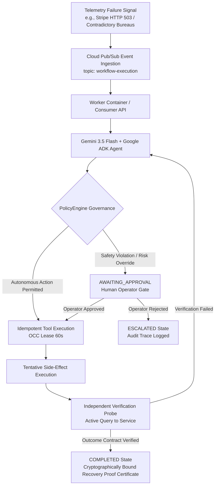

# RecoveryOS

> **The autonomous reliability/recovery layer for enterprise agent fleets.**
>
> *RecoveryOS governs autonomous operations with explicit autonomy boundaries, independently verifying external business outcomes before declaring recovery successful.*
>
> **Core Invariant:** `Action Executed ≠ Recovery Verified` • **Autonomy Principle:** `Autonomy is governed, not assumed.`

---

## 1. Executive Summary & Core Value Proposition

Traditional automation and AI agent systems run static playbooks (`DETECT → RUN TOOL`). If an automated tool completes with a success status, standard platforms assume the problem is solved—even if the downstream database remains corrupted, billing failed silently, or failover created duplicate subscriptions.

**Tool success is not business outcome success.**

**RecoveryOS treats independent verification as part of recovery itself.** When enterprise agent workflows fail or encounter operational anomalies, RecoveryOS follows a strict reliability loop:

$$\text{DETECT} \longrightarrow \text{DIAGNOSE} \longrightarrow \text{PLAN} \longrightarrow \text{EXECUTE} \longrightarrow \text{INDEPENDENTLY VERIFY} \longrightarrow \text{PROVE / ESCALATE}$$

When infrastructure or provider services fail:
1. **Detect**: Observes real-time telemetry failure signals across enterprise tools.
2. **Diagnose & Plan**: Gemini 3.5 Flash and Google ADK reason over failures against an explicit `OutcomeContract`.
3. **Govern**: The deterministic `PolicyEngine` evaluates blast radius, provider constraints, and safety rules.
4. **Execute**: Dispatches idempotent recovery actions using Optimistic Concurrency Control (OCC) leases.
5. **Independently Verify**: Actively probes external systems to verify actual business outcomes.
6. **Prove or Escalate**: Generates a tamper-evident **Recovery Proof Certificate** upon verified fulfillment, or safely halts at an explicit autonomy boundary for human operator sign-off.

---

## 2. Hackathon Technology Requirements Compliance

RecoveryOS is built natively on Google Cloud infrastructure and Google's agentic AI framework:

| Technology Component | Implementation Details & Role in RecoveryOS |
|:---|:---|
| **Gemini 3.5 Flash** | Primary LLM powering Google ADK agentic reasoning, prompt hydration, failure correlation, and adaptive recovery plan formulation (`backend/agents/agent_factory.py`, `backend/llm/resilience.py`). |
| **Google ADK (Agent Development Kit)** | Framework for multi-agent orchestration (`google-adk`), structured function calling, prompt composition, and session state management (`backend/engine/agent_runner.py`). |
| **Google Cloud Run** | Serverless container deployment hosting the FastAPI Control Plane API, static Operator Command Center UI, and worker consumers (`https://recoveryos-321161003794.asia-east1.run.app/`). |
| **Google Cloud Firestore** | Low-latency document store for persistent workflow states, OCC 60-second worker claims, idempotency keys, evidence records, and security audit logs (`backend/persistence/workflow_store.py`). |
| **Google Cloud Pub/Sub** | Asynchronous event bus for enterprise telemetry ingestion, worker message dispatching, and distributed push consumption (`backend/events/publisher.py`, `backend/events/consumer.py`). |

---

## 3. Fortified Enterprise Fleet Category Alignment

RecoveryOS is specifically engineered for the **Fortified Enterprise Fleet** track. Rather than acting as a generic agent directory or basic control plane dashboard, RecoveryOS provides **fortified governance and autonomous recovery** for enterprise agent fleets:

- **Bounded Autonomy**: Prevents runaway agent actions by enforcing zero-trust policy boundaries (`PolicyEngine`). Actions exceeding safety thresholds halt safely at `AWAITING_APPROVAL`.
- **Evidence-Backed Verification**: Requires independent external verification probes before satisfying contract outcomes.
- **Crash-Resilient State Engine**: Uses 60-second lease claims and idempotency records to reconcile worker crashes mid-mutation without duplicate side-effects.
- **Auditable Proof**: Issues cryptographically bound Recovery Proof Certificates containing full evidence traces, decision MTTR, and human authorization records.

---

## 4. Multi-Agent Architecture & Flow



### Multi-Agent Components:
- **Orchestrator Agent**: Primary ADK agent that reviews the workflow snapshot, contract outcomes, and active failure signals to coordinate recovery steps.
- **Verification Sub-Agents & Probes**: Independent, decoupled verification routines (`verify_outcome`) that execute separate queries to confirm business reality matches expected contract state.
- **PolicyEngine Gatekeeper**: Deterministic Python safety layer (`backend/engine/policy_engine.py`) evaluating blast radius, allowed providers, and human approval constraints before any agent action is dispatched.

---

## 5. Key Enterprise Capabilities Implemented

1. **Autonomous Recovery & Failover**: Automatic switching to secondary providers (e.g., Stripe HTTP 503 → PayPal failover) when primary infrastructure fails.
2. **Asynchronous Execution Engine**: Pub/Sub worker integration for non-blocking enterprise scale.
3. **Persistent Workflow State**: Immutable audit history and OCC versioning (`v1`, `v2`, ...) in Cloud Firestore.
4. **Independent Outcome Verification**: Verifies actual external state (e.g. active HTTP subscription probes) instead of trusting tool return codes.
5. **Liveness Protection & Auto-Redispatch**: Workflows in `RECOVERING` automatically resume or escalate if recovery budget is exhausted.
6. **Read-Only Decision Replay Engine**: Sequential replay (`PLAY`, `NEXT`, `REPLAY`) of historical event timelines without mutating database state.
7. **Deterministic UI State Hydration**: Immediate hydration from authoritative persisted snapshots with 0 false `IDLE` state flicker.

---

## 6. Demonstration Scenarios

| Scenario Name | Key Capability Demonstrated | Scenario Narrative & Result |
|:---|:---|:---|
| **01. Billing Provider Outage** (`billing_unavailable`) | **Autonomous Recovery** | Primary payment gateway (Stripe) returns HTTP 503 timeouts → Policy check passes (0 violations) → Autonomous failover to secondary provider (PayPal) → Verified via active PayPal subscription probe → State: `COMPLETED` (`RECOVERED • VERIFIED`). |
| **02. Contradictory Evidence** (`contradictory_evidence`) | **Bounded Autonomy** | Experian (42) and Equifax (88) report conflicting risk scores → Independent verification fails on billing tier mismatch → Policy detects risk threshold violation → Execution halts safely at `AWAITING_APPROVAL` (`ESCALATED • HUMAN INTERVENTION`) until human operator sign-off. |
| **03. Worker Interruption** (`worker_interruption`) | **Crash Resilience** | Worker container crashes mid-mutation → OCC lease expires after 60s → Replacement worker reconciles state against external service → Resumes idempotently without duplicate billing → State: `COMPLETED`. |

---

## 7. Direct Source Code Pointers for Judges

| Component | File Path | Architectural Responsibility |
|:---|:---|:---|
| **State Machine & Models** | [`backend/models/workflow.py`](backend/models/workflow.py) | WorkflowState enums, OutcomeContract, and transition invariants (`EXECUTING` → `COMPLETED` forbidden without verification). |
| **Deterministic Policy Engine** | [`backend/engine/policy_engine.py`](backend/engine/policy_engine.py) | Blast radius rules, provider permissions, and approval threshold evaluation. |
| **ADK Agent Loop & Runner** | [`backend/engine/agent_runner.py`](backend/engine/agent_runner.py) | Gemini 3.5 Flash prompt builder, ADK session management, and verification loop. |
| **Durable Firestore Store** | [`backend/persistence/workflow_store.py`](backend/persistence/workflow_store.py) | OCC versioning, 60s worker claims, idempotency deduplication, and evidence storage. |
| **Control Plane API Server** | [`backend/api/server.py`](backend/api/server.py) | FastAPI server, RBAC identity management, `/api/health`, and single-use SSE ticket streaming. |
| **Pub/Sub Worker Consumer** | [`backend/events/consumer.py`](backend/events/consumer.py) | Asynchronous message ingestion, claim validation, and distributed worker execution. |
| **Operator Command Center UI** | [`backend/api/static/app.js`](backend/api/static/app.js) | Authoritative single-state event machine, read-only replay engine, and live inspector. |

---

## 8. Canonical Production Deployment & Endpoints

- **Canonical Public Application URL**: `https://recoveryos-321161003794.asia-east1.run.app/`
- **Canonical Worker URL**: `https://recoveryos-worker-321161003794.asia-east1.run.app/`
- **Health Check Endpoint**: `https://recoveryos-321161003794.asia-east1.run.app/api/health`
- **Readiness Probe**: `https://recoveryos-321161003794.asia-east1.run.app/api/ready`
- **OpenAPI Interactive Documentation**: `https://recoveryos-321161003794.asia-east1.run.app/docs`

---

## 9. Local Development Setup & Quickstart

### Prerequisites
- Python 3.11+
- Google Cloud SDK (`gcloud`)

### Installation
```bash
# Clone the repository
git clone https://github.com/subodhkant7/recoveryos.git
cd recoveryos

# Create and activate virtual environment
python3 -m venv .venv
source .venv/bin/activate

# Install dependencies in development mode
pip install -e ".[dev]"
```

### Environment Variables
Configure `.env` or shell environment:
```bash
export ENVIRONMENT="production"
export GEMINI_MODEL="gemini-3.5-flash"
export PERSISTENCE_BACKEND="in_memory" # or "firestore" for Cloud Firestore
export EVENT_PUBLISHER_BACKEND="in_memory" # or "pubsub" for Cloud Pub/Sub
```

### Running Locally
```bash
source .venv/bin/activate
uvicorn backend.api.server:app --host 127.0.0.1 --port 8000
```
Access the application at `http://127.0.0.1:8000/console/`.

---

## 10. Automated Testing

Execute the complete automated regression suite (412 tests):
```bash
source .venv/bin/activate
python -m pytest tests/ -v
```

Execute targeted lifecycle and production hardening tests:
```bash
pytest tests/test_phase49_url_hardening_and_lifecycle.py tests/test_phase48_historical_hydration_and_urls.py tests/test_phase47_recovery_liveness.py -v
```
