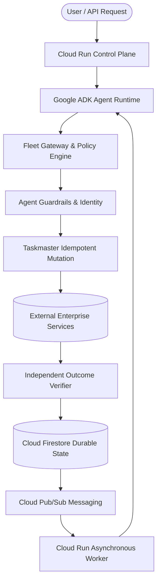

# RecoveryOS

**Governed autonomous recovery for enterprise agent fleets.**

> **Action Executed ≠ Recovery Verified**
> **Autonomy is governed, not assumed.**

RecoveryOS is the reliability and control layer for autonomous enterprise workflows. It detects a failure, lets an agent diagnose and propose a path, applies deterministic policy before any mutation, executes with idempotency and concurrency protection, then independently verifies the required business outcome. A tool response alone can never declare a workflow recovered.

---

## 30-Second Explanation

Enterprise agents can return `HTTP 200` while the business outcome remains broken. RecoveryOS closes that gap:

$$\text{DETECT} \longrightarrow \text{DIAGNOSE} \longrightarrow \text{PLAN} \longrightarrow \text{POLICY} \longrightarrow \text{EXECUTE} \longrightarrow \text{INDEPENDENTLY VERIFY} \longrightarrow \text{RECOVER OR ESCALATE}$$

- **Gemini 3.5 Flash on Vertex AI** supplies bounded reasoning inside a **Google ADK** agent execution runtime.
- **RecoveryOS-native deterministic code** remains the authoritative gate for policy, state transitions, idempotency, ground-truth outcome verification, and escalation.

---

## System Architecture



The system architecture diagrams are available as submission assets:
- Architecture Blueprint: [`artifacts/recoveros-architecture.png`](artifacts/recoveros-architecture.png)
- Thumbnail: [`artifacts/recoveros-thumbnail.png`](artifacts/recoveros-thumbnail.png)

---

## Division of Labor & Invariants

RecoveryOS is not another generic AI wrapper. An agent can reason and propose, but it is not allowed to declare a business outcome successful. RecoveryOS enforces this as a governed workflow:

| Concern | Enforced by |
| --- | --- |
| Failure diagnosis & recovery proposal | **Gemini 3.5 Flash on Vertex AI** (with bounded **Gemini 3.5 Flash Lite** fallback) through **Google ADK** |
| Agent execution framework & tool calling | **Google ADK** (`LlmAgent`, `Runner`, sessions, tool definitions) |
| Authorization, safety limits, human approvals | Deterministic `PolicyEngine` (`backend/engine/policy_engine.py`) |
| Duplicate side-effect protection | Canonical idempotency keys and distributed operation claims |
| Concurrent worker protection | Optimistic concurrency control (OCC) and worker lease heartbeats |
| Recovery truth | Independent outcome probes and the typed `OutcomeContract` |
| Failure boundary | Bounded recovery budget, authoritative reconciliation, then human escalation |

---

## Vertex AI & Model Fallback Semantics

Production uses **Google Vertex AI** (`LLM_PROVIDER=vertex`, `GOOGLE_GENAI_USE_VERTEXAI=true`, `GOOGLE_CLOUD_LOCATION=global`) authenticated via **Google Cloud service identity / Application Default Credentials (ADC)** rather than embedding model API keys.

### Critical Distinction: Model Failure vs. Business Failure

Documentation and operational telemetry strictly separate model-level failures from business-level workflow failures:

```
┌─────────────────────────────────────────────────────────────────────────────┐
│ 1. MODEL / PROVIDER FAILURE (HTTP 429, HTTP 503, Quota Exhaustion)          │
│    └─► Resilient Gemini Runtime: Exponential backoff + single-attempt       │
│        fallback from Gemini 3.5 Flash to Gemini 3.5 Flash Lite.             │
├─────────────────────────────────────────────────────────────────────────────┤
│ 2. BUSINESS / WORKFLOW FAILURE (Stripe 503, Contradictory Evidence,         │
│    Policy Denial, OCC Conflict, Worker Interruption)                        │
│    └─► Governed by RecoveryOS Engine: Diagnosis, alternative tool discovery,│
│        policy evaluation, and independent verification.                     │
│    └─► MUST NEVER trigger Gemini model fallback.                            │
└─────────────────────────────────────────────────────────────────────────────┘
```

- **Model Fallback**: If Vertex AI returns retryable infrastructure errors (HTTP 429 rate limiting, HTTP 503 model unavailable, or quota exhaustion), `ResilientGemini` executes bounded exponential backoff with jitter and falls back to `gemini-3.5-flash-lite`.
- **Business-Service Failures**: Failures in business tools (e.g. Stripe 503, PayPal failures, contradictory credit scores, policy blocks, guardrail denials, tenant mismatches, OCC version conflicts, or worker crashes) are standard domain events. They are diagnosed by the agent and governed by deterministic policy—**they do NOT trigger Gemini model fallback**.

---

## Role of Google ADK vs. RecoveryOS

- **Google ADK**: Provides the agent runtime, `LlmAgent` declarations, structured tool-calling interface, conversation sessions, and the `Runner` loop.
- **RecoveryOS**: Implements the deterministic control plane around ADK: the multi-agent fleet registry, zero-trust identity scopes, security gateway, deterministic policy engine, durable context store, Firestore persistence, Pub/Sub messaging, crash reconciliation, independent verification probes, and evidence collection. ADK does not perform persistence or outcome verification.

---

## Enterprise Agent Fleet Control Plane

RecoveryOS implements a multi-agent enterprise recovery control plane with strict separation of concerns:

```
                  ENTERPRISE AGENT FLEET
                           │
                           ▼
                    ORCHESTRATOR (ADK)
                           │
                ┌──────────┴──────────┐
                │                     │
                ▼                     ▼
       TASKMASTER EXECUTION    RECOVERY SPECIALIST
        (Mutating Agent)       (Read-Only Diagnosis)
                │                     │
                │                     ▼
                │              RECOVERY PLAN
                │                     │
                └──────────┬──────────┘
                           │
                           ▼
                    AGENT GATEWAY
                           │
                    ┌──────┴──────┐
                    │             │
                 IDENTITY     GUARDRAILS
                    │             │
                    └──────┬──────┘
                           │
                           ▼
                      POLICY ENGINE
                           │
                           ▼
                    MUTATING TOOLS
                           │
                           ▼
               INDEPENDENT VERIFICATION
                           │
                           ▼
                    FIRESTORE EVIDENCE
                           │
                    ┌──────┴──────┐
                    │             │
                    ▼             ▼
                  PROVE       RECOVER /
                              ESCALATE
```

> **First-Party Equivalence Statement**:
> RecoveryOS implements first-party equivalents for enterprise agent fleet capabilities rather than claiming integration with Gemini Enterprise Agent Platform (GEAP) products.

### Control Plane Subsystems

1. **Orchestrator** ([`backend/agents/agent_factory.py`](backend/agents/agent_factory.py)): Top-level Google ADK coordinator managing sub-agent handoffs between execution and diagnosis.
2. **Recovery Specialist** ([`backend/agents/agent_factory.py`](backend/agents/agent_factory.py)): Dedicated read-only Gemini reasoning agent that diagnoses failures, queries service health, and creates structured `RecoveryPlan` objects.
3. **Taskmaster** ([`backend/agents/agent_factory.py`](backend/agents/agent_factory.py)): Unified execution agent executing policy-gated mutations and approved recovery plans.
4. **Independent Verification** ([`backend/tools/onboarding/tools.py`](backend/tools/onboarding/tools.py)): Deterministic query probes verifying ground-truth service state (`Action Executed ≠ Recovery Verified`).
5. **Agent Registry** ([`backend/fleet/registry.py`](backend/fleet/registry.py)): Cross-department agent discovery with typed Agent Cards, versioning, capability declarations, allowed tools, and data scopes.
6. **Agent Identity & Zero-Trust Scope** ([`backend/fleet/identity.py`](backend/fleet/identity.py)): Bound agent identities enforcing tenant isolation, role boundaries, and fine-grained data scopes before tool invocation.
7. **Agent Gateway** ([`backend/fleet/gateway.py`](backend/fleet/gateway.py)): Centralized routing and policy boundary chaining agent identity checks, tenant/scope validation, deterministic policy rules, and structured security audit decisions.
8. **Durable Agent Context** ([`backend/fleet/context_store.py`](backend/fleet/context_store.py)): Structured state persistence across extended timelines and worker interruption events.
9. **RecoveryOS Agent Guardrails** ([`backend/fleet/guardrails.py`](backend/fleet/guardrails.py)): Deterministic safety inspector checking sensitive fields, prompt injection indicators, unknown tools, and unauthorized scopes before mutation.
10. **Fleet Observability** ([`backend/fleet/observability.py`](backend/fleet/observability.py)): OpenTelemetry-compatible structured audit traces capturing W3C `trace_id`, `span_id`, `parent_span_id`, agent IDs, decisions, and tool executions.
11. **Failure-Tolerant Inter-Agent Routing** ([`backend/fleet/routing.py`](backend/fleet/routing.py)): Explicit routing from primary specialist agents to fallback recovery agents within a bounded recovery budget to prevent unbounded loops.

---

## Verified Scenario Behaviors

The live demonstration showcases three deterministic scenarios in a synthetic enterprise environment (no real credit cards or financial accounts are charged):

### 1. `billing_unavailable` (Autonomous Failover & Independent Verification)
1. Primary billing provider (`stripe`) returns `HTTP 503 Service Unavailable`.
2. Recovery Specialist diagnoses the outage, queries provider health, and discovers `paypal` as an available alternative.
3. Recovery Specialist submits a structured `RecoveryPlan` proposing failover to PayPal.
4. `PolicyEngine` evaluates the proposal against risk rules and grants autonomous approval.
5. Taskmaster executes `setup_billing` with `provider="paypal"`, acquiring an operation claim and canonical idempotency key.
6. Taskmaster initiates `verify_outcome` for `billing_configured`, issuing an independent query to confirm an active enterprise subscription.
7. Remaining onboarding steps complete normally; workflow transitions to `RECOVERED • VERIFIED` (6/6 outcomes verified).
8. Evidence-Backed Recovery Proof renders on the command center canvas.

### 2. `contradictory_evidence` (Governed Autonomy Boundary)
1. `setup_billing` executes on Stripe and returns a tentative success message.
2. Independent verification probe queries the billing service and detects that the subscription plan is actually `starter` rather than the required `enterprise`.
3. Outcome verification marks `billing_configured = FAILED` with explicit discrepancy details.
4. `PolicyEngine` halts autonomous execution due to contradictory evidence.
5. Workflow transitions to `AWAITING_APPROVAL` and dispatches an approval request.
6. **Autonomy is stopped**: The system does NOT automatically switch providers, retry, activate the account, or send welcome emails without human authorization.
7. An authenticated human approver must explicitly review the discrepancy and decide whether to approve or escalate.

### 3. `worker_interruption` (Crash Reconciliation & Recovery Redispatch)
1. External billing mutation succeeds on the target service.
2. A simulated worker crash/interruption occurs before the local Firestore transaction commits.
3. The worker's 60-second lease expires, leaving the workflow in an interrupted state.
4. A replacement worker executes `reconcile_interrupted_workflow()`, checking external ground truth against the target service.
5. Reconciliation confirms the external mutation succeeded, advances state to `RECOVERING`, and publishes a `RECOVERY_TRIGGER` event to Pub/Sub.
6. Resumed worker picks up the workflow, executes independent outcome verification, and finishes the remaining steps without duplicating the billing mutation.
7. Workflow completes with 6/6 verified outcomes.

---

## Evidence-Backed Recovery Proof

The Command Center renders an **Evidence-Backed Recovery Proof** upon workflow completion. The proof dynamically correlates exact domain action and verification pairs from durable Firestore records:

- **Billing Action** (`setup_billing`) $\longleftrightarrow$ **Billing Verification** (`verify:billing_configured`)
- **Identity Action** (`verify_identity`) $\longleftrightarrow$ **Identity Verification** (`verify:identity_verified`)
- **Document Action** (`validate_documents`) $\longleftrightarrow$ **Document Verification** (`verify:documents_validated`)
- **Risk Action** (`run_risk_check`) $\longleftrightarrow$ **Risk Verification** (`verify:risk_assessed`)
- **Account Action** (`activate_account`) $\longleftrightarrow$ **Account Verification** (`verify:account_activated`)
- **Welcome Action** (`send_welcome_package`) $\longleftrightarrow$ **Welcome Verification** (`verify:welcome_sent`)

> **Transparency Note**:
> The Recovery Proof is an evidence-backed presentation of authoritative Firestore audit logs and outcome verification records. It is not cryptographically signed or presented as tamper-evident.

---

## Local Setup & Development

### 1. Prerequisites & Environment

```bash
# Clone and enter directory
cd "Recovery OS"

# Create and activate virtual environment
python3 -m venv .venv
source .venv/bin/activate
pip install -e '.[dev]'
```

### 2. Configure Vertex AI (Recommended)

```bash
# Authenticate with Google Cloud ADC
gcloud auth application-default login

# Configure Vertex AI environment
export LLM_PROVIDER=vertex
export GOOGLE_GENAI_USE_VERTEXAI=true
export GOOGLE_CLOUD_PROJECT=your-gcp-project-id
export GOOGLE_CLOUD_LOCATION=global
export GEMINI_MODEL=gemini-3.5-flash
export GEMINI_FALLBACK_MODEL=gemini-3.5-flash-lite
export PERSISTENCE_BACKEND=in_memory
export EVENT_PUBLISHER_BACKEND=in_memory
```

*Note for offline / API key development*: You can optionally configure `LLM_PROVIDER=gemini_api` and `GOOGLE_API_KEY=your_api_key`.

### 3. Run Application Server

```bash
uvicorn backend.api.server:app --host 127.0.0.1 --port 8000
```

Open [http://127.0.0.1:8000/](http://127.0.0.1:8000/) in your browser.

---

## Production Deployment & Verification

- **Canonical URL**: [https://recoveryos-321161003794.asia-east1.run.app/](https://recoveryos-321161003794.asia-east1.run.app/)
- **Compute**: Cloud Run (`asia-east1`)
- **Persistence**: Cloud Firestore (`recoveryosdb`)
- **Messaging**: Cloud Pub/Sub (`recoveryos-workflow-execution`)
- **Reasoning**: Vertex AI (`gemini-3.5-flash` with `gemini-3.5-flash-lite` fallback)

```bash
# Health probe (reports configured Gemini model and environment)
curl -sS https://recoveryos-321161003794.asia-east1.run.app/api/health

# Readiness probe (reports active persistence backend)
curl -sS https://recoveryos-321161003794.asia-east1.run.app/api/ready
```

---

## Testing & Quality Gates

Run the comprehensive test suite (540+ automated tests across unit, integration, security, and fleet specifications):

```bash
# Full test suite
uv run --no-sync pytest -q

# Fleet control plane tests
uv run --no-sync pytest tests/test_fleet_*.py -q

# Production acceptance suite (executes against live Cloud Run)
uv run --no-sync pytest tests/test_production_acceptance_cloud_run.py -q
```
