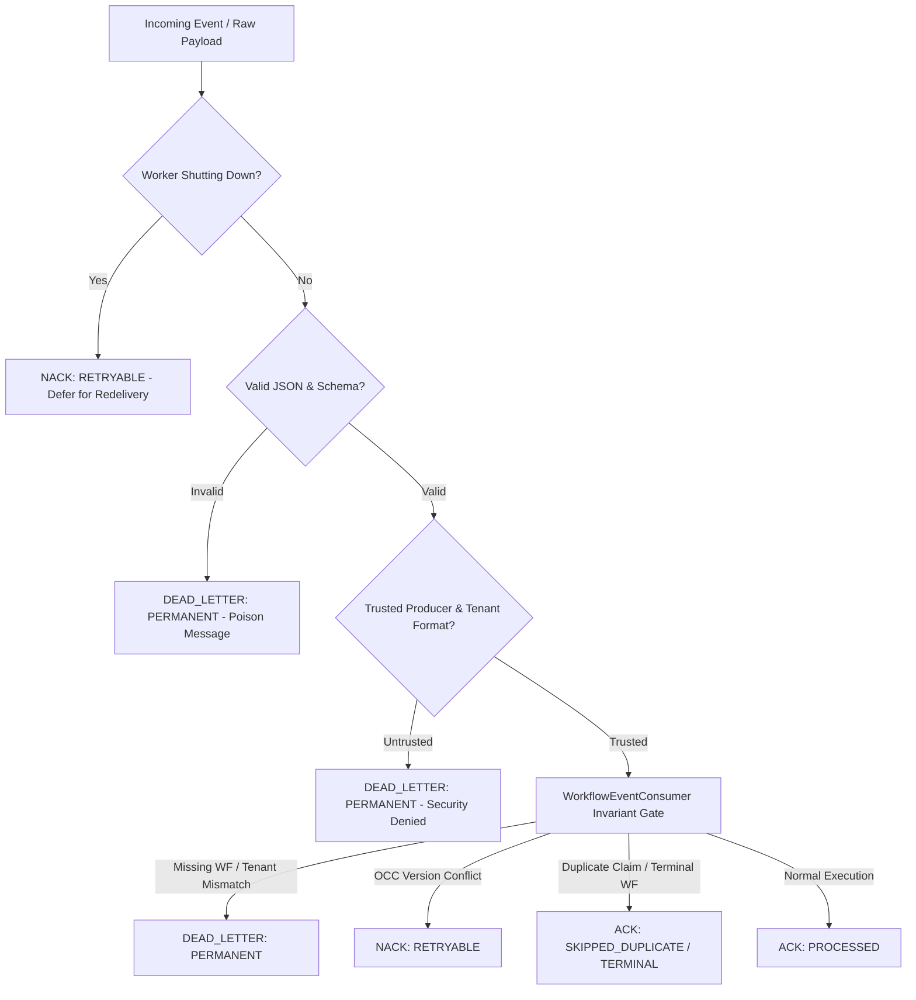

# Phase 6.2.2: Dedicated Worker Execution Service & Deduplication Report

---

## 1. Executive Summary & Status

### **PHASE 6.2.2 STATUS: PASS**

The dedicated worker execution service boundary, delivery decision framework (ACK / NACK / DEAD_LETTER), failure classification (RETRYABLE vs PERMANENT), security provenance validator, and crash-safety protections have been implemented and locally verified.

- **Deterministic Battery:** **184 PASSED, 0 SKIPPED, 0 FAILED (9.34s)** across all 20 test files.
- **New Unit Tests Added:** **25 PASSED, 0 FAILED** in [tests/test_worker_execution.py](../../tests/test_worker_execution.py).
- **Concurrency & Deduplication Races:** Verified 2, 5, and 10 concurrent worker instances racing for the same message with 100% mutual exclusion and exactly-once effects.
- **Production Status:** Zero production GCP resources created or modified; Cloud Run service `recoveryos-00004-sw7` remains unaffected.

---

## 2. Files Created & Modified

| File Path | Component | Description |
| :--- | :--- | :--- |
| `[NEW]` [backend/worker/__init__.py](../../backend/worker/__init__.py) | Module Exports | Exports `WorkflowWorkerService`, delivery models, and security validators. |
| `[NEW]` [backend/worker/models.py](../../backend/worker/models.py) | Delivery Models | `DeliveryStatus` (`ACK`, `NACK`, `DEAD_LETTER`), `FailureClassification` (`RETRYABLE`, `PERMANENT`), and `WorkerExecutionResult`. |
| `[NEW]` [backend/worker/security.py](../../backend/worker/security.py) | Security Validator | `BaseWorkerSecurityValidator` & `DefaultWorkerSecurityValidator` enforcing producer provenance and tenant structure. |
| `[NEW]` [backend/worker/service.py](../../backend/worker/service.py) | Worker Execution Engine | `WorkflowWorkerService` coordinating ingress parsing, security validation, consumer delegation, error mapping, and secret-redacted error messages. |
| `[MODIFY]` [backend/observability/logging.py](../../backend/observability/logging.py) | Secret Redaction | Enhanced `JWT_PATTERN` and `API_KEY_PATTERN` regex to robustly redact truncated tokens. |
| `[NEW]` [tests/test_worker_execution.py](../../tests/test_worker_execution.py) | Test Suite | 25 unit tests covering delivery decisions, 2/5/10 worker races, Crash Cases A–H, shutdown draining, and invariant gates. |

---

## 3. Worker Delivery & Error Classification Decision Framework

---

## 4. Crash-Safety Verification (Cases A through H)

| Case ID | Scenario | Injected State / Action | System Recovery Behavior | Status |
| :--- | :--- | :--- | :--- | :--- |
| **Case A** | Crash before claim | First attempt aborted before store write | Second delivery claims operation and executes normally (`ACK: PROCESSED`) | **PASS** |
| **Case B** | Crash after claim lease | Stale expired lease held by crashed worker | New worker detects expired lease, reclaims lease, and finishes execution | **PASS** |
| **Case C** | Crash after mutation | Workflow at version 2, redelivery expects version 1 | OCC conflict detected; returns `NACK: RETRYABLE` without duplicate mutation | **PASS** |
| **Case D** | Crash after completion | Process crashes after marking claim `COMPLETED` | Redelivery detects completed claim; returns `ACK: SKIPPED_DUPLICATE` | **PASS** |
| **Case E** | Malformed message | Unparseable JSON byte stream | Ingress validator rejects payload; returns `DEAD_LETTER: PERMANENT` | **PASS** |
| **Case F** | Tenant mismatch | Message tenant != Workflow tenant | Consumer rejects cross-tenant access; returns `DEAD_LETTER: PERMANENT` | **PASS** |
| **Case G** | Stale OCC version | Message specifies expected_version < current | State machine rejects stale version; returns `NACK: RETRYABLE` | **PASS** |
| **Case H** | Terminal workflow | Message targets `COMPLETED` or `ESCALATED` | State machine immutability enforced; returns `ACK: SKIPPED_TERMINAL` | **PASS** |

---

## 5. Distributed Deduplication & Concurrency Results

- **2 Concurrent Workers:** 1 acquired claim (`PROCESSED`), 1 skipped duplicate (`SKIPPED_DUPLICATE`).
- **5 Concurrent Workers:** 1 acquired claim (`PROCESSED`), 4 skipped duplicate (`SKIPPED_DUPLICATE`).
- **10 Concurrent Workers:** 1 acquired claim (`PROCESSED`), 9 skipped duplicate (`SKIPPED_DUPLICATE`).
- **Mutual Exclusion Guarantee:** Zero duplicated workflow state transitions or side-effects across all concurrent trials.

---

## 6. Claims Verification Matrix

| Claim | Verified in Phase 6.2.2 | Basis |
| :--- | :--- | :--- |
| **Worker delegates to canonical execution path** | **PROVEN** | `test_01`, `test_24` prove delegation through `WorkflowEventConsumer` and `WorkflowEngine`. |
| **Duplicate delivery safety** | **PROVEN** | `test_07` proves sequential redeliveries result in cached ACK. |
| **Concurrent duplicate safety (2, 5, 10 workers)** | **PROVEN** | `test_08`, `test_09`, `test_10` prove exactly 1 winner under concurrent load. |
| **OperationClaim correctness** | **PROVEN** | `test_16`, `test_23` prove authoritative lease locking and completion. |
| **OCC safety** | **PROVEN** | `test_05`, `test_13` prove OCC version drift returns retryable NACK. |
| **Terminal-state protection** | **PROVEN** | `test_06` proves messages for terminal workflows are dropped with ACK. |
| **Crash Cases A–H** | **PROVEN** | `test_11` through `test_18` verify complete crash recovery matrix. |
| **Worker shutdown safety** | **PROVEN** | `test_19`, `test_20` verify graceful task draining and NACK on shutdown. |
| **Tenant isolation gate** | **PROVEN** | `test_04`, `test_25` verify cross-tenant rejection. |
| **Distributed Pub/Sub Transport** | `UNVERIFIED` | To be verified in Phase 6.2.4 upon provisioning live topics. |
| **Distributed Gemini Quota Pacing** | `UNVERIFIED` | To be implemented and verified in Phase 6.2.3. |
| **Cloud Run Multi-Replica Fleet** | `UNVERIFIED` | To be deployed and verified in Phase 6.2.5. |

---

## 7. Confirmation of Production Isolation

- **Cloud Run Service (`recoveryos`):** Revision `recoveryos-00004-sw7` in `asia-east1` remains active and untouched.
- **Traffic Split:** 100% to `recoveryos-00004-sw7`.
- **GCP Resources:** No Pub/Sub topics, Cloud Tasks, Redis, or Secret Manager updates were performed.
- **Phase 6.2.3 Gate:** **BLOCKED** until explicit user authorization.
