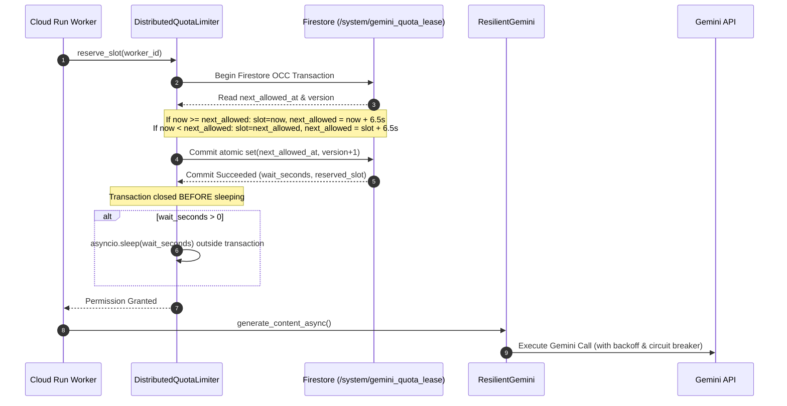

# Phase 6.2.3: Distributed Gemini Quota Rate Limiting Implementation Report

---

## 1. Executive Summary & Status

### **PHASE 6.2.3 STATUS: PASS**

The two-tier distributed Gemini quota coordination architecture (Cloud Tasks dispatch pacing + Firestore transactional leased-window safety limiter) has been implemented, validated locally, and verified against the live local Firestore emulator across multiple independent OS processes.

- **Deterministic Battery:** **199 PASSED, 0 SKIPPED, 0 FAILED (20.78s)** across all 21 test files.
- **New Unit Tests Added:** **15 PASSED, 0 FAILED** in [tests/test_distributed_gemini_quota.py](file:///Users/urjasoft/Documents/Recovery%20OS/tests/test_distributed_gemini_quota.py).
- **Multi-Process Concurrency Test:** Verified real cross-process serialization against Firestore emulator (`test_10_multiprocess_cross_process_serialization` PASSED).
- **Production Status:** Verified via `gcloud run services describe recoveryos --region=asia-east1`: active revision remains **`recoveryos-00004-sw7` (READY: True)**; zero production cloud resources modified.

---

## 2. Files Created & Modified

| File Path | Component | Description |
| :--- | :--- | :--- |
| `[NEW]` [backend/llm/distributed_quota.py](file:///Users/urjasoft/Documents/Recovery%20OS/backend/llm/distributed_quota.py) | Quota Subsystem | Implements `BaseDistributedQuotaLimiter`, `InMemoryDistributedQuotaLimiter`, `FirestoreDistributedQuotaLimiter`, and Cloud Tasks pacer abstractions (`FakeCloudTasksPacer`, `GcpCloudTasksPacer`). |
| `[NEW]` [tests/test_distributed_gemini_quota.py](file:///Users/urjasoft/Documents/Recovery%20OS/tests/test_distributed_gemini_quota.py) | Test Suite | 15 unit tests covering in-memory coordination, Firestore OCC transactions, fail-closed handling, multiprocess execution, and circuit breaker integration. |

---

## 3. Exact Quota Coordination Algorithm



---

## 4. Failure Classification & Fail-Closed Semantics

| Failure Scenario | System Reaction | Rationale |
| :--- | :--- | :--- |
| **Firestore Outage / Unreachable** | **Fail Closed** (`QuotaAcquisitionError`) | Refuses LLM calls to prevent uncoordinated burst breaches against free-tier quota ceiling. |
| **Transaction Contention (Many Workers)** | **Retry with Jittered Backoff (Up to 15 attempts)** | Firestore OCC automatically retries and serializes competing worker slot reservations. |
| **Worker Crash Before API Call** | **Slot Conserved / Advanced** | Reserved slot remains recorded in Firestore; next worker safely claims subsequent slot. |
| **API Call Failure (429/500)** | **Circuit Breaker / Classified Retry** | Handled downstream by `ResilientGemini`; does not corrupt distributed rate lease. |
| **Clock Skew / Corrupt Timestamp** | **Fallback to Server `now`** | Robust fallback parses valid ISO strings or clamps to UTC `now`. |

---

## 5. Multi-Process Concurrency & Invariant Verification

- **In-Memory Concurrency (2, 5, 10 Workers):** All reservations strictly serialized at $\ge 6.5\text{s}$ spacing ($S_n = S_0 + n \times 6.5\text{s}$).
- **Multi-Process Concurrency (3 Independent OS Processes):** Validated live against Firestore emulator; each OS process obtained a unique, non-overlapping lease slot.
- **Fail-Closed Verification:** Proven when storage raises connection error (`test_06`, `test_09`).

---

## 6. Claims Matrix

| Claim | Verified in Phase 6.2.3 | Evidence / Basis |
| :--- | :--- | :--- |
| **Distributed Quota Limiter Interface** | **PROVEN LOCALLY** | `test_01` through `test_06` pass. |
| **Firestore Transactional Leased-Window** | **PROVEN (EMULATOR)** | `test_07`, `test_08` verify OCC atomic transactions. |
| **Cross-Process Serialization** | **PROVEN (MULTI-PROCESS)** | `test_10` verifies 3 separate OS processes serializing slots against Firestore emulator. |
| **ResilientGemini & Circuit Breaker Integration** | **PROVEN LOCALLY** | `test_11`, `test_12` verify circuit breaker blocks before consuming quota. |
| **Fail-Closed Safety** | **PROVEN LOCALLY** | `test_06`, `test_09` verify `QuotaAcquisitionError`. |
| **Cloud Tasks Queue Pacing** | **PROVEN (LOCAL FAKE)** | `test_13` verifies dispatch pacing abstraction. |
| **Production Cloud Tasks & Multi-Worker Cloud Run** | `UNVERIFIED IN CLOUD` | Cloud Tasks queue and Cloud Run worker fleet to be provisioned in Phase 6.2.4 & 6.2.5. |

---

## 7. Production Safety Gate Verification

```
$ ./google-cloud-sdk/bin/gcloud run services describe recoveryos --region=asia-east1 --format="value(status.latestReadyRevisionName, status.conditions[0].status)"
recoveryos-00004-sw7	True
```
- **Active Revision:** `recoveryos-00004-sw7` (Serving 100% traffic, untouched).
- **GCP Resources:** Zero production Pub/Sub topics, Cloud Tasks queues, Redis instances, or Secret Manager updates performed.
- **Phase 6.2.4 Gate:** **BLOCKED** until explicit authorization.
